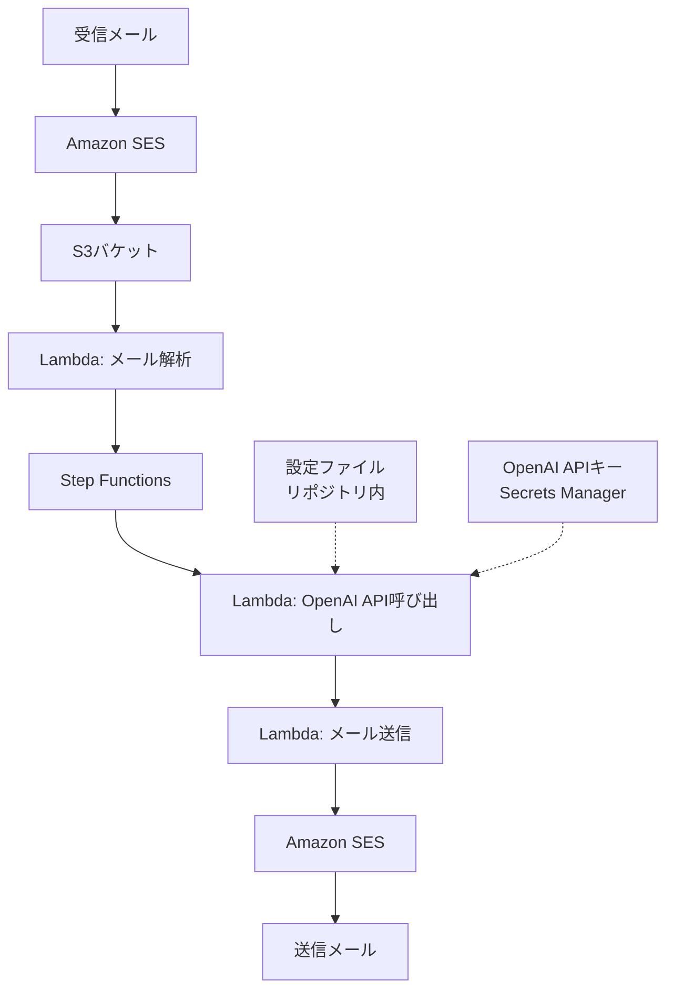

# AI Mail Pal 設計ドキュメント

## 概要

AI Mail Palは、受信したメールに対してAIが自動で返信を生成し、適切な遅延を持って送信するシステムです。メールアドレスのローカルパート（@より前の部分）ごとに異なる応答スタイルを設定でき、柔軟な対応が可能です。

## アーキテクチャ

### 全体構成



### コンポーネント

1. **Amazon SES**
   - メールの受信と送信を担当
   - 受信したメールはS3バケットに保存
   - 送信時は適切な設定（DKIM, SPF等）を使用

2. **S3バケット**
   - メールバケット: 受信メールの一時保存

3. **設定ファイル**
   - リポジトリ内の config/default.json に保存
   - ビルド時にバンドルされ、Lambda関数内で利用可能

3. **Lambda関数**
   - parse-mail: メールの解析とStep Functions開始
   - call-openai: OpenAI APIを使用した返信生成
   - send-mail: メール送信処理

4. **Step Functions**
   - 全体のワークフローを管理
   - エラーハンドリングと再試行ロジック
   - 遅延ステップの制御

### データフロー

1. メール受信フロー
   ```mermaid
   sequenceDiagram
       participant User as ユーザー
       participant SES as Amazon SES
       participant S3 as S3バケット
       participant Lambda as 解析Lambda
       
       User->>SES: メール送信
       SES->>S3: メール保存
       S3-->>Lambda: トリガー
       Lambda->>Lambda: メール解析
       Lambda->>Step Functions: ワークフロー開始
   ```

2. 返信生成フロー
   ```mermaid
   sequenceDiagram
       participant SF as Step Functions
       participant Config as リポジトリ内設定
       participant OpenAI as OpenAI API
       participant Lambda as OpenAI Lambda
       
       SF->>Lambda: 関数呼び出し
       Lambda->>Config: 設定読み込み
       Lambda->>OpenAI: API呼び出し
       OpenAI-->>Lambda: 返信生成
       Lambda-->>SF: 結果返却
   ```

3. メール送信フロー
   ```mermaid
   sequenceDiagram
       participant SF as Step Functions
       participant Lambda as 送信Lambda
       participant SES as Amazon SES
       participant User as ユーザー
       
       SF->>Lambda: 関数呼び出し
       Lambda->>SES: メール送信
       SES->>User: 返信メール
   ```

## 設定管理

### システムプロンプト設定

```json
{
  "prompts": {
    "support": {
      "systemPrompt": "サポートチーム用のプロンプト...",
      "signature": "AIサポートチーム"
    },
    "sales": {
      "systemPrompt": "営業チーム用のプロンプト...",
      "signature": "AI営業部"
    }
  },
  "default": {
    "systemPrompt": "デフォルトのプロンプト...",
    "signature": "AI自動応答システム"
  }
}
```

### 遅延設定

- 最小遅延時間: 5分（300秒）
- 最大遅延時間: 15分（900秒）
- ランダムな遅延を生成して人間らしい応答時間を演出

## エラーハンドリング

1. **メール解析エラー**
   - 不正なフォーマット
   - 添付ファイルの処理エラー
   - → エラーログを記録し、管理者に通知

2. **OpenAI APIエラー**
   - API制限
   - トークン制限
   - → 自動リトライ後、継続的なエラーは管理者に通知

3. **メール送信エラー**
   - SES制限
   - 不正な宛先
   - → エラーログを記録し、必要に応じて再試行

## スケーラビリティ

- Lambda関数は自動でスケール
- Step Functionsで並列実行を制御
- SESの送信制限に注意が必要

## セキュリティ

1. **認証・認可**
   - IAMロールによる最小権限の原則
   - SecretsManagerでAPIキーを管理

2. **データ保護**
   - S3バケットの暗号化
   - メールデータの一時保存のみ
   - 個人情報の適切な取り扱い

3. **監査**
   - CloudWatchによるログ記録
   - メール送受信の追跡

## 運用管理

1. **モニタリング**
   - Lambda関数のエラーレート
   - Step Functionsの実行状態
   - OpenAI APIの使用量
   - SESの送信統計

2. **アラート**
   - 継続的なエラー発生時
   - API制限に近づいた場合
   - 異常な送信パターンの検出

3. **コスト管理**
   - Lambda実行時間
   - Step Functions状態遷移
   - OpenAI API使用量
   - SES送信量

## 今後の拡張性

1. **機能拡張**
   - 添付ファイルの処理
   - HTMLメールのサポート
   - 多言語対応

2. **インテグレーション**
   - チケットシステムとの連携
   - CRMシステムとの統合
   - 社内チャットツールへの通知

3. **AI機能の強化**
   - 感情分析による優先度付け
   - コンテキスト理解の改善
   - カスタムモデルの導入
